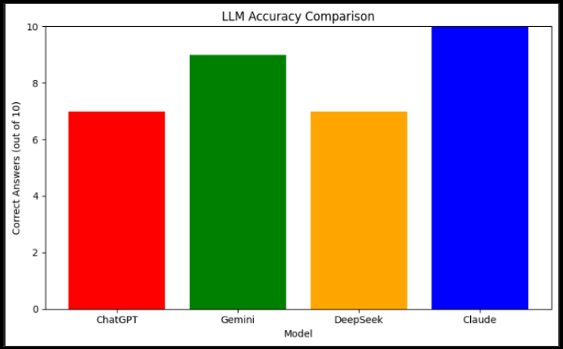
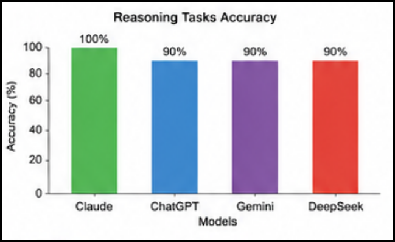
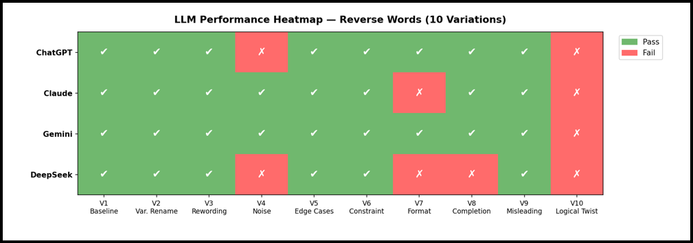

# LLM Robustness Testing: Evaluating Reasoning Robustness Across Mathematical and Coding Tasks

A structured empirical study evaluating the reasoning robustness of four frontier Large Language Models (LLMs)—ChatGPT, Gemini, Claude, and DeepSeek—across mathematical reasoning and coding tasks.

The project investigates whether small changes to a problem, while keeping the underlying solution the same, affect model performance.

> Collaborative Academic Research Project

---

# Overview

Large Language Models (LLMs) often achieve high accuracy on standard benchmark problems. However, recent research suggests that their performance can change when the same problem is presented differently.

This project evaluates the robustness of four leading LLMs using prompt variations inspired by published research. Rather than measuring accuracy alone, the study examines how changes such as increased complexity, irrelevant information, language ambiguity, and prompt wording influence model performance.

Across all evaluations, the models generally performed well on baseline tasks but showed reduced accuracy on more challenging variations. These findings are consistent with previous research suggesting that current LLMs can be sensitive to changes in problem presentation.

---

# Repository Structure

```text
├── images/
│   ├── mwp-performance.png
│   ├── reasoning-performance.png
│   └── coding-heatmap.png
│
├── mathematical-word-problems/
│   ├── gsm-symbolic/
│   │   ├── MWP_Gulati_Paper.xlsx
│   │   ├── Prompts_MWP.pdf
│   │   └── MWP_Robustness_Report.pdf
│   │
│   └── reasoning-tasks/
│       ├── LLM_RESULTS.xlsx
│       └── General_Reasoning_Report.docx
│
├── coding-tasks/
│   ├── LLM_Code_Testing.xlsx
│   └── Coding_Robustness_Report.docx
│
├── STs-Project.xlsx
└── README.md
```

---

# Evaluations

## 1. Mathematical Word Problems (MWP)

This evaluation examines how well LLMs solve mathematical reasoning problems when the problems are modified without changing their underlying logic.

### A. GSM-Symbolic Evaluation

**Framework:** GSM-Symbolic (Gulati et al., 2024)

Ten prompt variations were created from a baseline mathematical word problem.

| ID | Variation |
|----|-----------|
| V1 | Baseline problem |
| V2 | Symbolic variation (decimal values) |
| V3 | Symbolic variation (large numerical values) |
| V4 | Additional constraints |
| V5 | No-Op (irrelevant information) |
| V6 | Additional clauses |
| V7 | Multi-step reasoning |
| V8 | Algebraic transformation |
| V9 | Logical constraints |
| V10 | No-Op + Multi-step complexity |

### Results

| Model | Correct | Accuracy |
|--------|---------|----------|
| Claude | 10 / 10 | **100%** |
| Gemini | 9 / 10 | 90% |
| ChatGPT | 7 / 10 | 70% |
| DeepSeek | 7 / 10 | 70% |

<p align="center">
  
</p>

**Key Findings**

- All models correctly solved the baseline and symbolic variations (V1–V3).
- Performance declined on several higher-complexity variations (V6–V10).
- Algebraic reasoning (V8) and the combined No-Op + complexity variation (V10) produced the largest differences between models.
- Claude was the only model to correctly solve all ten variations.

---

### B. Reasoning Tasks

This evaluation consisted of ten custom-designed reasoning questions covering multiple reasoning categories.

The questions included:

- Arithmetic reasoning
- Logical reasoning
- Probability reasoning
- Language ambiguity

### Results

| Model | Accuracy |
|--------|----------|
| Claude | **100%** |
| ChatGPT | 90% |
| Gemini | 90% |
| DeepSeek | 90% |

<p align="center">
  
</p>

**Key Findings**

- All models performed well on most reasoning questions.
- Language ambiguity produced the most common errors.
- Several models provided only one interpretation of an ambiguous question, even though two valid interpretations were possible.
- These findings suggest that ambiguous wording can influence model performance.

---

## 2. Coding Tasks

**Framework:** Based on Hooda et al. (2024) and Wang et al. (2022)

Ten prompt variations of the same coding problem were created while keeping the required programming logic unchanged.

| Variation | Purpose |
|-----------|---------|
| Baseline | Reference solution |
| Variable Renaming | Naming robustness |
| Instruction Rewording | Prompt wording |
| Noise Injection | Ignore irrelevant information |
| Edge Cases | Special input handling |
| Constraint Addition | Additional programming constraints |
| Format Disruption | Messy formatting |
| Code Completion | Partial code reasoning |
| Misleading Context | Ignore unrelated context |
| Logical Twist | Constraint modification |

### Results

| Model | Correct |
|--------|----------|
| Gemini | **9 / 10** |
| ChatGPT | 8 / 10 |
| Claude | 8 / 10 |
| DeepSeek | 7 / 10 |

<p align="center">
  
</p>

**Key Findings**

- The Logical Twist variation caused all four evaluated models to fail.
- Noise Injection affected ChatGPT and DeepSeek.
- Format Disruption affected Claude and DeepSeek.
- Gemini achieved the highest overall accuracy in this evaluation.

---

# Overall Performance

The table below summarizes the performance of all evaluated models across the three project evaluations.

| Evaluation | ChatGPT | Gemini | Claude | DeepSeek |
|------------|----------|---------|---------|----------|
| Mathematical Word Problems (GSM-Symbolic) | 70% | 90% | **100%** | 70% |
| Reasoning Tasks | 90% | 90% | **100%** | 90% |
| Coding Tasks | 8 / 10 | **9 / 10** | 8 / 10 | 7 / 10 |

---

# Contributors

- **Hanan Ahmed Moosa** — Mathematical Word Problems (GSM-Symbolic)
- **Mohammed Ahmed** — Reasoning Tasks
- **Asma Alwan** — Coding Tasks

---

# References

- Gulati, A., et al. (2024). *GSM-Symbolic: Understanding the Limitations of Mathematical Reasoning in Large Language Models.*
- Hooda, A., et al. (2024). *Do Large Code Models Understand Programming Concepts? Counterfactual Analysis for Code Predicates.*
- Wang, S., et al. (2022). *ReCode: Robustness Evaluation of Code Generation Models.*
- Song, P., Han, P., & Goodman, N. (2026). *Large Language Model Reasoning Failures.*
